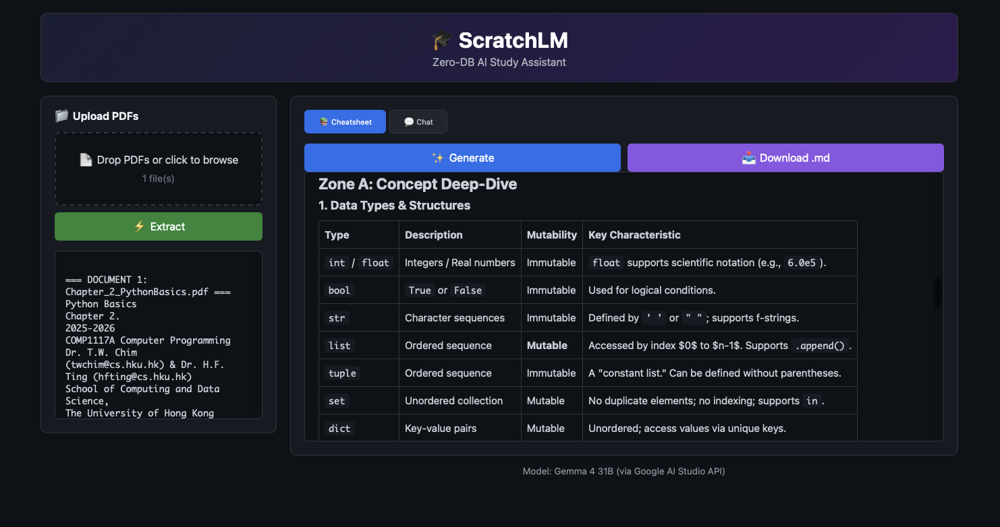

# ScratchLM

[](https://www.python.org/downloads/)
[](https://fastapi.tiangolo.com/)

[](https://ai.google.dev/)
[](https://www.gnu.org/licenses/agpl-3.0.en.html)

<div align="center">
  <br/>
  <a href="https://huggingface.co/spaces/mingnatthakitt/ScratchLM">
    
  </a>
  <br/>
  <br/>
</div>

**Zero-DB AI Study Assistant** - Upload PDFs, extract content, and get AI-powered cheatsheets and interactive tutoring.

<p align="center">
  
</p>

## ✨ Key Features

### 📄 Local PDF Processing
- **Drag & Drop Upload**: Upload multiple PDFs directly in your browser
- **Local Extraction**: Text extraction happens entirely on the server
- **Multi-Document Support**: Process multiple PDFs simultaneously with clear demarcation

### 📚 AI-Powered Cheatsheet Generator
- **4-Zone Structure**: Automatically generates comprehensive study guides:
  - **Zone A**: Concept Deep-Dive
  - **Zone B**: Real-World Analogies
  - **Zone C**: Worked Problems
  - **Zone D**: Exam Traps & Strategy
- **Markdown Export**: Download cheatsheets as `.md` files for Obsidian, Notion, or any app

### 💬 AI Chat with Full Context
- **Document-Aware**: Chat remembers everything from your uploaded PDFs
- **Conversation History**: Multi-turn dialogues with context retention
- **Step-by-Step Teaching**: AI tutor explains concepts rather than just answering

### 🔒 Privacy First
- **Zero Database**: No user data stored anywhere
- **Session Isolation**: Each browser tab is isolated
- **One-Click Wipe**: Refresh the page to clear all data

---

## 🎓 AI Architecture

### Model: Gemma 4 31B IT
The app uses **Gemma 4 31B Instruction-Tuned** model via Google AI Studio API for:
- Complex reasoning and explanation generation
- Multi-step problem solving
- Conceptual teaching with analogies

### PDF Processing: pypdf
- Pure Python PDF text extraction
- No external services or cloud dependencies
- Preserves document structure and page breaks

---

## 🛠️ Technical Stack

| Component | Technology |
|-----------|------------|
| Web Framework | FastAPI |
| Frontend | Vanilla HTML/CSS/JS |
| AI Model | Gemma 4 31B IT |
| PDF Parsing | pypdf |
| Markdown Rendering | marked.js |

---

## 🚀 Getting Started

### Prerequisites
- A Google AI Studio API key (free tier available)
- Docker (for local development)

### Local Setup

1. **Clone the repository**:
   ```bash
   git clone https://huggingface.co/spaces/mingnatthakitt/ScratchLM
   ```

2. **Set up environment variable**:
   ```bash
   export GEMINI_API_KEY="your_api_key_here"
   ```

3. **Run with Docker**:
   ```bash
   docker build -t scratchlm .
   docker run -p 7860:7860 -e GEMINI_API_KEY=$GEMINI_API_KEY scratchlm
   ```

   Or run without Docker:
   ```bash
   pip install -r requirements.txt
   python app.py
   ```

4. **Open in browser**:
   Navigate to `http://localhost:7860`

### Hugging Face Spaces

1. **Fork the Space**: Clone it to your account
2. **Add Secrets**: Go to Space Settings → Repository secrets → Add `GEMINI_API_KEY`
3. **Done**: The Space will automatically build and run

---

## 📖 How to Use

### Step 1: Upload PDFs
Drag and drop PDF files onto the upload area, or click to browse.

### Step 2: Extract Text
Click **⚡ Extract** to process your documents. The extracted text will appear in the preview panel.

### Step 3: Generate Cheatsheet
Click **✨ Generate** to create a comprehensive 4-zone study guide from your documents.

### Step 4: Download or Chat
- **📥 Download .md**: Save the cheatsheet as a Markdown file
- **💬 Chat**: Ask questions about your documents with full context awareness

---

## ⚖️ License

**GNU Affero General Public License v3.0 (AGPL-3.0)**

This program is free software: you can redistribute it and/or modify it under the terms of the GNU Affero General Public License as published by the Free Software Foundation, either version 3 of the License, or (at your option) any later version.

This program is distributed in the hope that it will be useful, but WITHOUT ANY WARRANTY; without even the implied warranty of MERCHANTABILITY or FITNESS FOR A PARTICULAR PURPOSE. See the GNU Affero General Public License for more details.

You should have received a copy of the GNU Affero General Public License along with this program. If not, see <https://www.gnu.org/licenses/agpl-3.0.en.html>.

---

## 🙏 Acknowledgments

- **Google AI** for providing Gemma models via AI Studio
- **Hugging Face** for the Spaces infrastructure
- **FastAPI** for the excellent web framework
